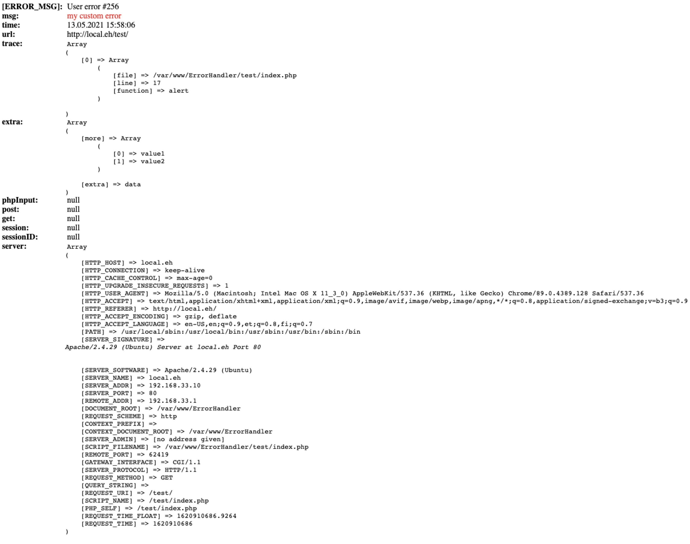

ErrorHandler
=====================

###Comprehensive php error,notice, etc. handler.

Once in a while some bug gets into production what didn't show up in tests.
ErrorHandler catches your defined error levels made by php-core, user, and custom errors and outputs it to browser,
or you can make a custom wrapper to handle errors. Look examples below.


#Install

* Minimum Requirements - PHP 8
```bash
$ composer require infira/errorhandler
```

#Usage

##Raising user errors

```php
use Infira\Error\Error;

alert("my error",['extra'=>'data']); //it's a helper to Error::trigger
Error::trigger("my error",['extra'=>'data']);
```

##Catching & displaying errors

```php
use Infira\Error\Handler;
require_once "vendor/autoload.php";
Handler::register();
try
{
	alert("my error",['extra'=>'data']);
	//OR
	callingNotExistingMethod();
	//OR
	echo $a
}
catch (Throwable $e) {
	echo Handler::compile($e)->getHTMLTable();
}
```

getHTMLTable() will output, with all the goodies server has to offer


That's it! Your application is catching errors!

##Using compiled Exception data

```php
use Infira\Error\Handler;
require_once "vendor/autoload.php";
Handler::register();
try
{
	makeError
}
catch (Throwable $e) {
    echo "<pre>".print_r(Handler::compile($e)->toArray(); //outputs all data that has been collected
}
```